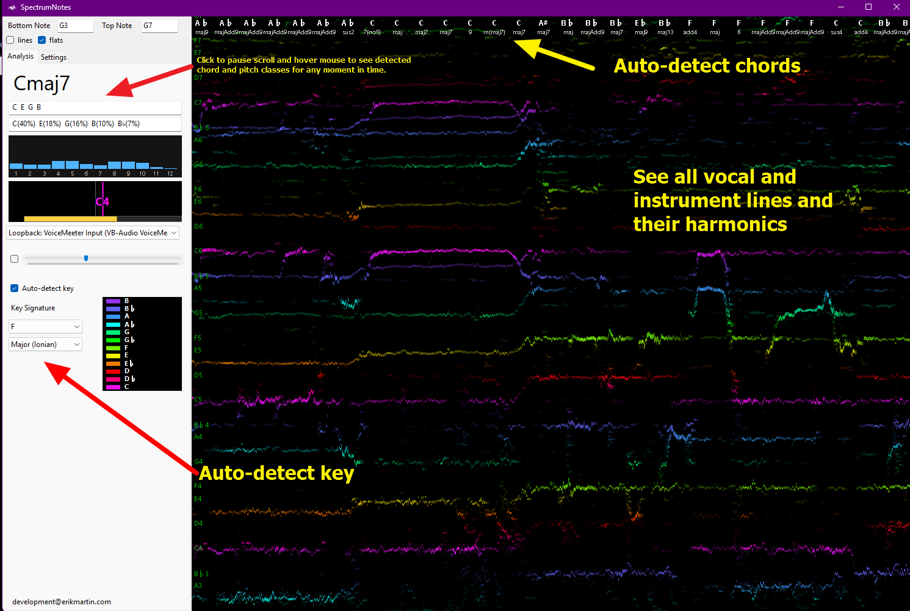
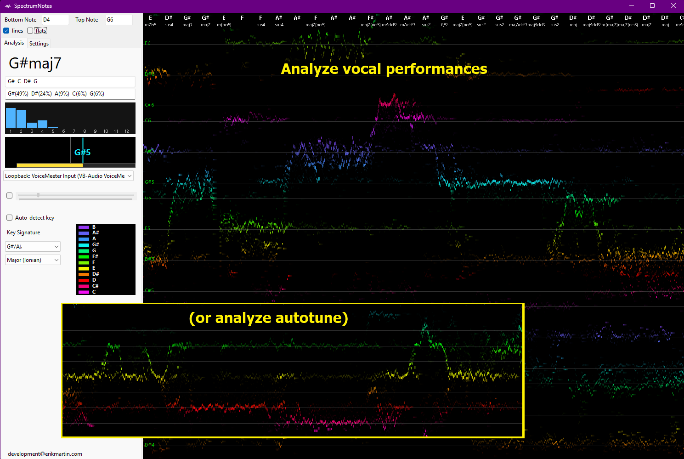
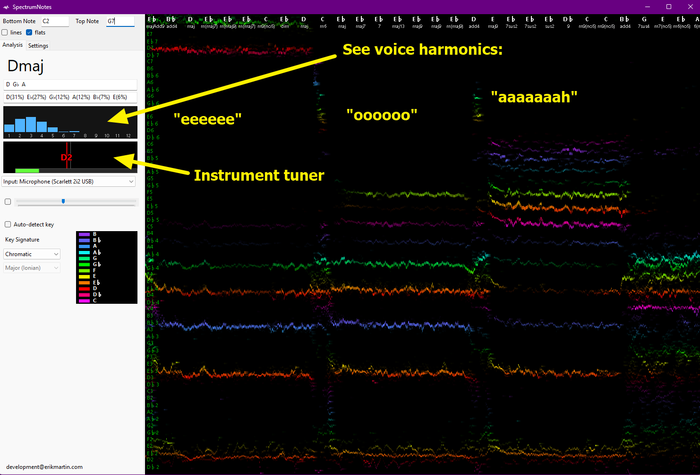

# SpectrumNotes

## Overview

Live polyphonic pitch and harmonic analysis. Automatic pitch, harmonic, chord, and key detection.

Windows 10+ 64-bit desktop application

## Download
[⬇️ Download Version v1.0.0](https://github.com/erikmartin99/SpectrumNotes/releases/download/v1.0.0/SpectrumNotesSetup.exe)

To check if there's a more recent release, [click here](https://github.com/erikmartin99/SpectrumNotes/releases/)

## License

GPL-3.0-or-later. See LICENSE.
Copyright (C) 2026 Erik Martin.

## Disclaimer

This software is provided as-is with no warranty. Pitch detection accuracy varies and should not be relied upon for critical applications.

## Installation

Run the Windows installer from the latest GitHub release. (See the "releases" link, possibly on the right.)

## Usage

## Contributing

[Fork the repo, open a Pull Request, and send me an email](https://github.com/erikmartin99/SpectrumNotes)

## Other

If you were looking for my youtube page, click here: [videos.erikmartin.com](https://videos.erikmartin.com/)

